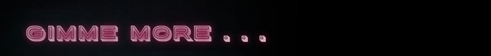
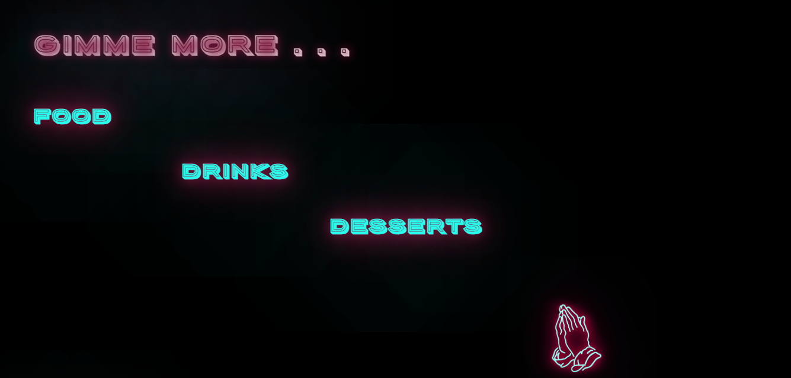
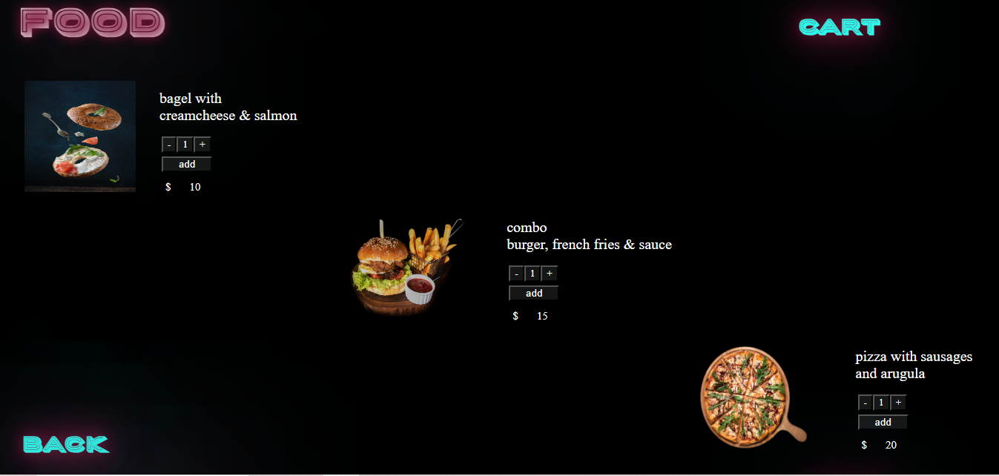
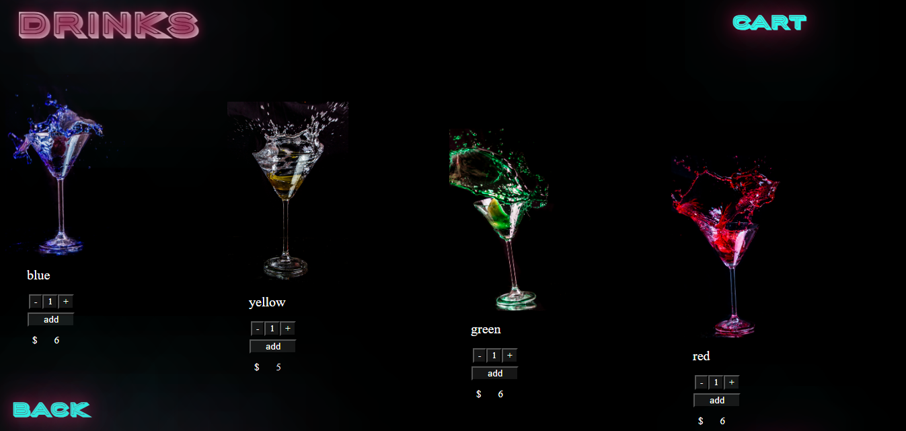
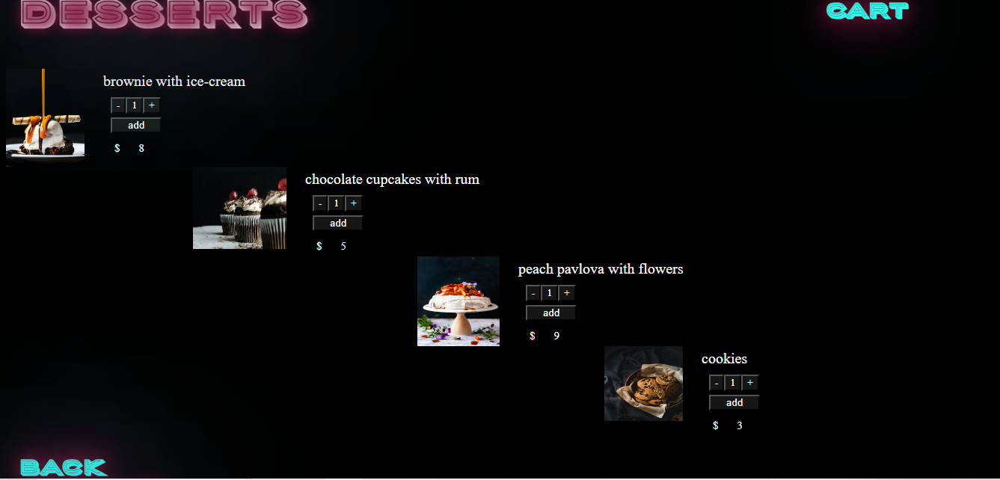
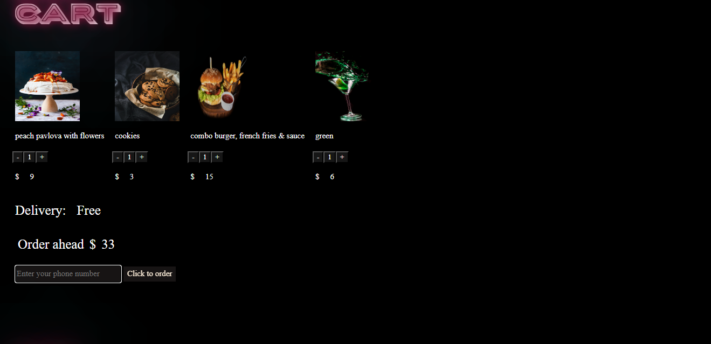

<h1>CAFE GIMME MORE </h1>

This  project of the site of the takeout cafe.
This cafe has got the own style and the main goal of this site is to introduce the cofe's conception to the visitors, show advantages of the restaurant such as desing, vibes.
 
<h3>Features</h3>
The site users can: 
<ul>
<li> choose the interesting category (food, drinks or desserts) and follow the link not scrolling </li>

<li> take a look at Menu and Price;</li>

<li> add the item to the cart;</li>
<li> make the order getting the finish price.</li>

</ul>

<h3>Contributing</h3>
Bug reports and/or pull requests are welcome.

<h3>Liscence</h3>
The project can be used for educational purposes 

-----

Made using HTML/CSS/JavaScript

